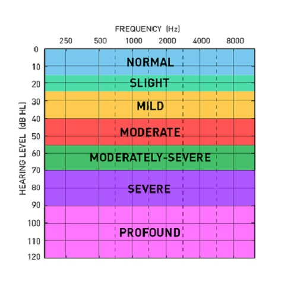
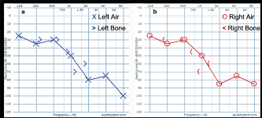

# Overview
	- A chart displaying each ears response to sound at different frequencies (typically 60hz to 10khz).
	- This test informs treatment of [[Meniere's Disease]] , [[Dehiscence]], .....
# Interpreting an Audiogram
	- blah blah - dip in the high frequencies hearing loss
	- Low frequency hearing loss [[Meniere's Disease]]
	- ...
# Examples
	- 
	- DB hearing level on the left .....
	- Frequency above ranges from low rumble on the left to high pitched and crackly sounds
- 
-